[English](README.en.md) | [简体中文](#)

# Fusion360 机电协同 —— 嘉立创 EDA 专业版扩展

通过 WebSocket + HTTP 实现 PCB 3D 模型在嘉立创 EDA 与 Fusion360 之间的实时协同。支持模型导出、双向位置同步、交叉定位、删除同步。

## 功能特性

| 功能      | 说明                                   |
| ------- | ------------------------------------ |
| 3D 模型导出 | 将 PCB 的 STEP 模型分片传输到 Fusion360，支持大文件 |
| 下载脚本文件  | 一键保存 Fusion360 Add-In 脚本到本地          |
| 双向位置同步  | EDA 拖动元件 → Fusion360 跟着动，反之亦然        |
| 交叉定位    | 点击一边的元件，另一边自动聚焦                      |
| 删除同步    | EDA 删除元件，Fusion360 同步移除              |

***

## 环境要求

| 项目          | 要求                     |
| ----------- | ---------------------- |
| 嘉立创 EDA 专业版 | ≥ 3.0                  |
| Fusion360   | 已安装且可运行                |
| Python      | Fusion360 自带 Python 环境 |
| 网络          | 本机可用（localhost）        |

***

## 安装步骤

### 第一步：安装 EDA 扩展

1. 打开 **嘉立创 EDA 专业版**
2. 安装完成后，在扩展列表中找到 **Fusion360机电协同**，确认已启用
3. **开启外部交互权限**：点击 **扩展** → **扩展设置** → 开启 **外部交互** 权限（WebSocket 通信需要）

### 第二步：安装 Fusion360 脚本

1. 下载脚本
   （脚本文件也可以通过 EDA 菜单 **Fusion360机电协同** → **下载脚本文件** 一键保存到本地）
   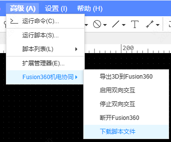
2. 打开 **Fusion360**  新建一个文档
   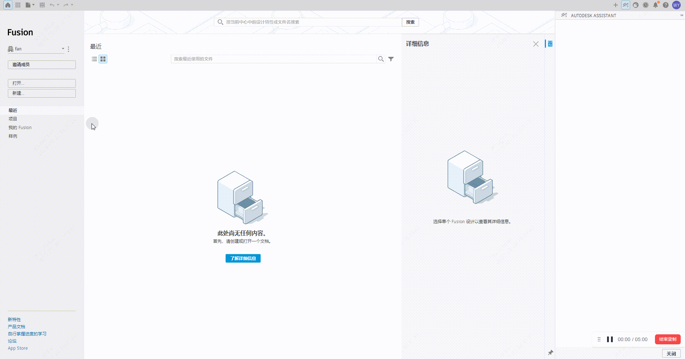
3. 新建模块
   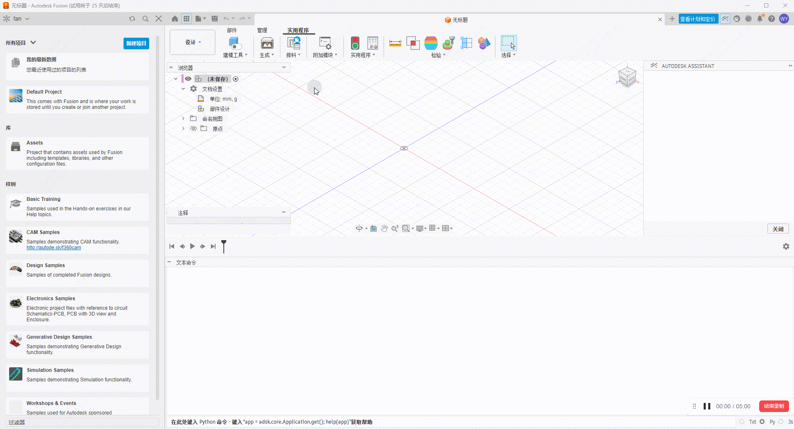
4. 打开脚本文件所在位置 用下载的脚本文件替换脚本内容 注意脚本需要和创建时候脚本名字一致
   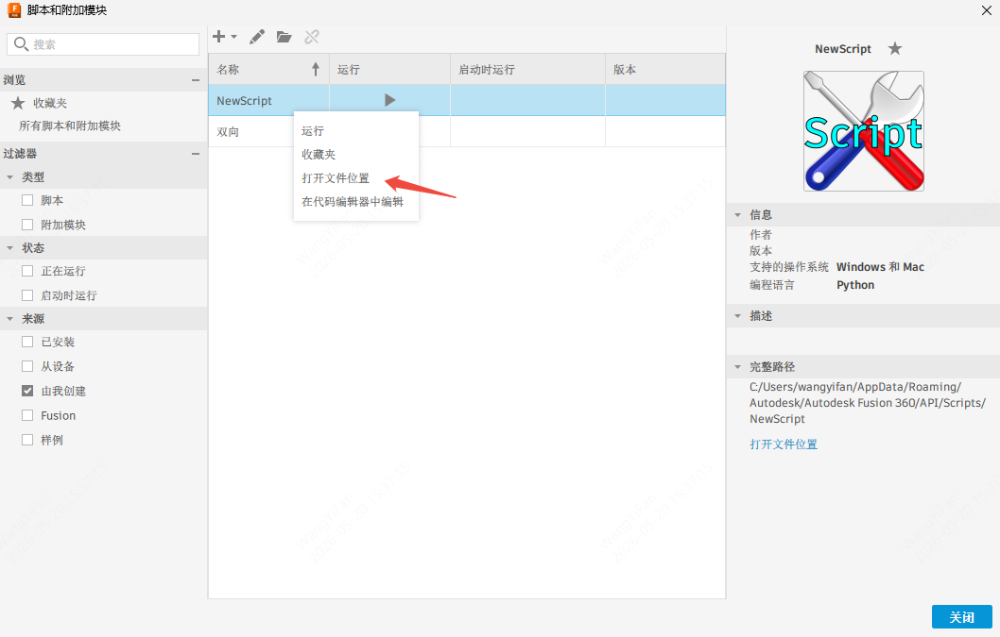
   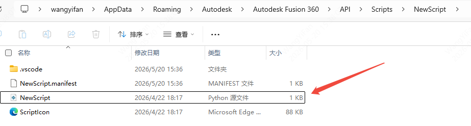
5. 点击运行  这里注意一定是运行模块而不是脚本文件

   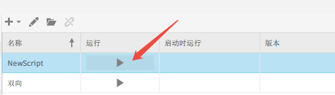
6. **验证启动成功**：在 Fusion360 的文本命令窗口中应看到：

```
[EasyEDA] CustomEvent registered
[EasyEDA] Add-in 启动完成 ✅
[EasyEDA] Starting WebSocket server on ws://0.0.0.0:8767
```

## 使用教程

### 一、导出 3D 模型到 Fusion360

1. 确保 Fusion360 Add-In 脚本已运行
2. **在 Fusion360 中新建或打开一个部件设计文档**

    

   如果脚本已经运行，直接点击导出按钮即可 会自动打开一个新文档
3. 在 EDA 中打开一个 PCB 设计文件，进入 **PCB 编辑器**
4. 点击菜单 **Fusion360机电协同** → **导出3D到Fusion360**

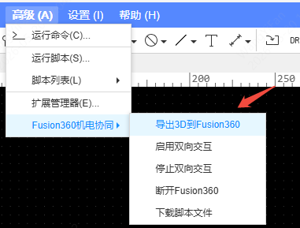\
5\. 自动连接 Fusion360、获取 STEP 文件并分片上传

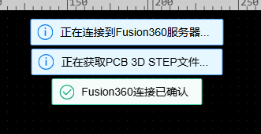

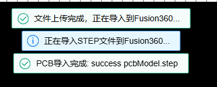

### 三、启用双向交互

导出模型后，可以启用双向交互实现实时同步：

1. 点击菜单 **Fusion360机电协同** → **启用双向交互**
   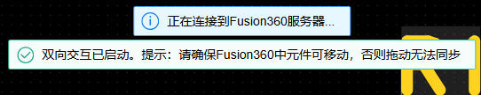
2. EDA 会自动将元件位号与 Fusion360 3D 对象建立映射（build\_mapping）
3. 映射成功后可以：
   - **在 EDA 中拖动元件** → Fusion360 中的 3D 模型实时跟随移动
   - **在 Fusion360 中拖动对象** → EDA 中的元件同步移动（通过 HTTP 轮询检测位置变化）
   - **在 EDA 中点击元件** → Fusion360 自动选中并聚焦（闪烁高亮）
   - **在 Fusion360 中点击对象** → EDA 自动定位到对应元件

> **已知限制：**
>映射关系是一一对应的 开多个页面会导致映射关系冲突 请在单页面操作时使用


### 四、停止双向交互

1. 点击菜单 **Fusion360机电协同** → **停止双向交互**

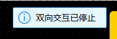

1. 所有映射关系和监听会被清除

### 五、连接管理

| 菜单选项           | 功能               |
| -------------- | ---------------- |
| 导出3D到Fusion360 | 自动连接 + 分片上传 + 导入 |
| 启用双向交互         | 开启实时双向同步         |
| 停止双向交互         | 关闭同步并清理映射        |
| 断开Fusion360    | 断开 WebSocket 连接  |
| 下载脚本文件         | 保存 Fusion360  脚本 |

***

## 技术说明

### 通信架构

```
EDA ←— WebSocket:8767 —→ Fusion（命令通道：上传/映射/位置更新/交叉定位）
EDA ←— HTTP:8768/poll ←— Fusion（状态通道：选中检测/位置变化）
```

| 方向           | 协议        | 说明                         |
| ------------ | --------- | -------------------------- |
| EDA → Fusion | WebSocket | 文件上传、位号映射、位置同步、交叉定位、删除、重命名 |
| Fusion → EDA | HTTP 轮询   | 每 2 秒检测选中状态和位置变化，返回给 EDA   |

### 关键技术决策

| 项目           | 方案                                        | 原因                                                                     |
| ------------ | ----------------------------------------- | ---------------------------------------------------------------------- |
| WebSocket 实现 | 纯 Python 手写                               | Fusion360 环境无法安装第三方库                                                   |
| HTTP 服务器     | Python 内置 `http.server`                   | 轮询检测 Fusion 状态变更                                                       |
| STEP 导入      | `executeTextCommand('Translator.Import')` | 可从后台线程安全调用，绕过 DataFile 限制                                              |
| 选中/移动检测      | HTTP 轮询 `ui.activeSelections`             | Fusion360 API 事件（`activeSelectionChanged`、`selectionEvent`）在此版本不响应元件选择 |
| 位置变化阈值       | 位置 0.1mm，旋转 0.5°                          | 过滤浮点噪声，避免反馈循环                                                          |

### 线程安全

Fusion360 API 要求所有文档操作在主线程执行，但 WebSocket/HTTP 运行在后台线程。

- **读操作**（选中检测、位置读取）：直接从 HTTP/WS 后台线程调用，实际可用但不完全稳定
- **写操作**（位置更新、交叉定位、删除）：通过 WS 接收命令后直接调用
- **`executeTextCommand`**：可安全从后台线程调用（Fusion 内部在主线程执行）
- 轮询间隔 2 秒可减少线程竞争导致的闪退概率

## 常见问题

### 连接 Fusion360 失败

请按顺序检查：

1. **Fusion360 是否已启动**，且 Add-In 脚本已运行
2. **端口 8767/8768 是否被占用** — 关闭 Fusion360 后重试
3. **外部交互权限** — EDA 扩展设置中是否已开启外部交互权限
4. **防火墙** — 检查 Windows 防火墙是否拦截了端口

### 导入后 Design OK 但看不到模型

确保在导入前已打开或新建了一个 **部件设计** 文档。`Translator.Import` 会将 STEP 导入到当前激活的文档中。

### 导入大文件时 Fusion360 卡住

Fusion360 的 STEP 导入是同步操作，大文件导入期间界面可能无响应。导入完成后自动恢复。代码中 `time.sleep(3)` 等待导入完成。

### 双向交互一段时间后 Fusion360 闪退

这是 Fusion360 API 的线程安全限制。后台线程（HTTP/WS）读取 Fusion API 与主线程竞争可能导致崩溃。降低轮询频率可缓解（当前 2 秒一次）。

### Fusion360 中选中元件 EDA 没反应

1. 确认已开启双向交互（日志中应有 `Monitor enabled`）
2. 轮询间隔 2 秒，选中后等待 1-2 秒
3. 检查位号映射是否正确建立（日志中应有 `Mapping: X / Y matched`）

***

## 项目结构

```
pcb-export-to-fusion/
├── src/
│   └── index.ts                         # EDA 扩展主逻辑（TypeScript）
├── script/
│   ├── Interactive-with-fusion.py       # Python脚本
├── config/
│   ├── esbuild.common.ts                # 构建配置
│   └── esbuild.prod.ts
├── build/
│   ├── packaged.ts                      # 打包脚本
│   └── dist/
├── locales/
│   ├── zh-Hans.json                     # 中文翻译
│   └── en.json                          # 英文翻译
├── images/
│   └── logo.png                         # 扩展图标
├── extension.json                       # 扩展配置清单
├── package.json
└── tsconfig.json
```

